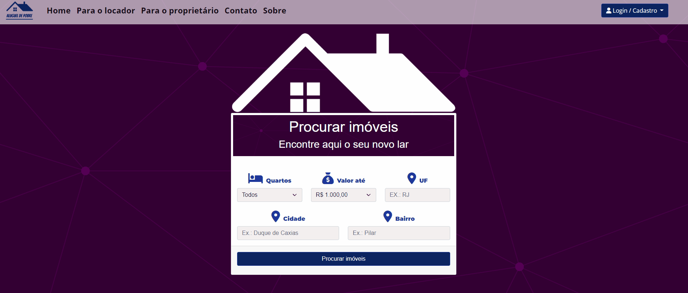
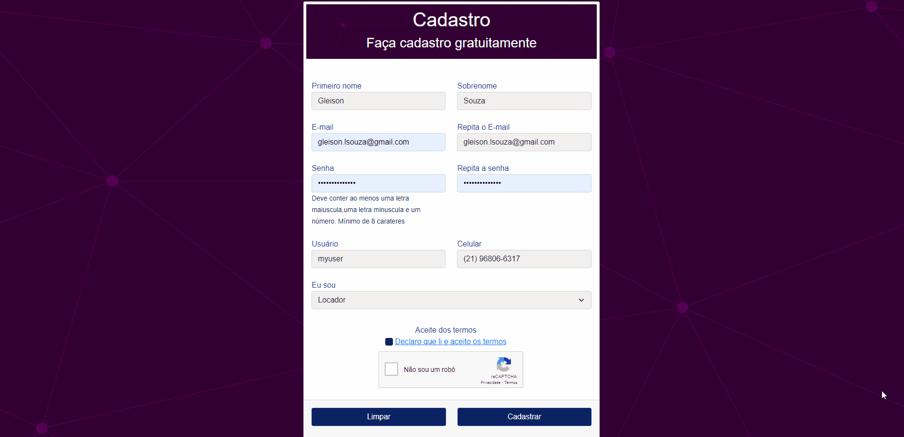
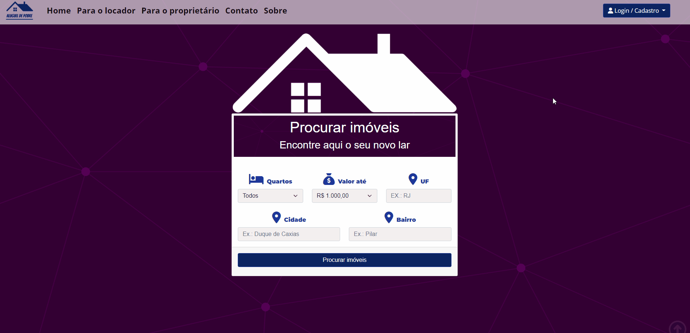
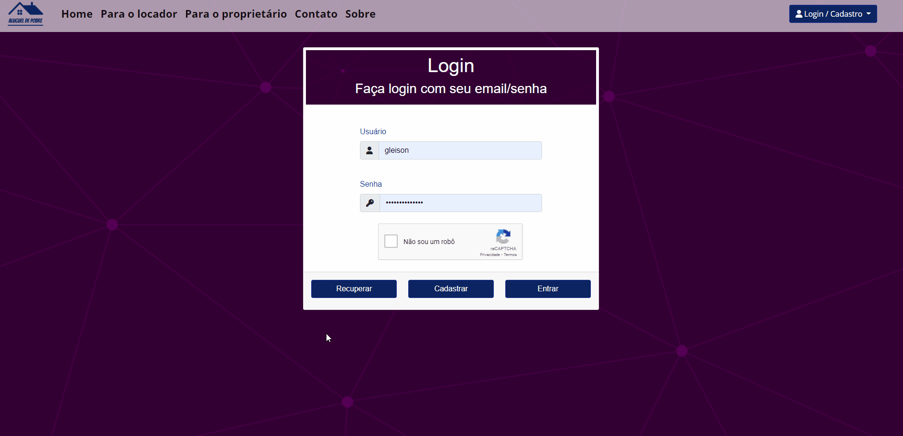

# AP - Aluguel de Pobre

Real estate rental system / Sistema de aluguel de imóveis

<a href='#english'>English</a>
-
<a href='#português'>Português</a>

# English

## Index:

* [About](#about)
* [Features](#features)
    * [Autocomplete](#autocomplete)
    * [User register](#user-register)
    * [User Login](#user-login)
    * [Password recovery](#password-recovery)
    * [Search by houses](#search-by-houses)
    * [Ad details](#ad-details)
    * [User panel](#user-panel)
* [Installation guide](#instalattion-guide)

 

# About

The idea of Aluguel de Pobre came up after noticing the typical questions asked on social networks looking for
                 cheap real estate in middle-class neighborhoods.
                 Most rental sites are geared towards properly regularized properties, properties with
                 long months contract, but we middle class people are used to
                 rent a house with a "mouth contract" or as it is also known as a "drawer contract".

But what about the name Aluguel de Pobre?

The site's name was strategically thought to cause a buzz, it's easy to stick, it's suggestive,
     can become a topic in the circle of friends even if I like "just kidding", but that with
     sure when thinking about renting a good and cheap house, the name Aluguel de Pobre will soon come to mind, this
     facilitate "word of mouth" dissemination.

We know that a popular rental is usually dealt with directly with the owner (landlord) and that there is no
     a lot of bureaucracy, some charge a deposit which is a type of guarantee in case there is
     any damage to the residence after the tenant leaves, or if the tenant becomes unemployed,
     or if you decide to leave the property, so you will still have a few months already paid, in addition to
     we know that there are no rental sites that accept houses in communities, on our platform it is
     possible you register a property and inform the name of the community. Putting all these together
     questions I decided to develop this simple and effective platform that will help both those who are looking for
     cheap rent as those who are looking to advertise their properties.

 

# Features

## Autocomplete

The system has an autocomplete function that searches for information directly from the database

    

 

## User register

### What's in the registry system

* Field validation
* Terms of use and privacy
* Google Recaptcha

    

 

## User login

### What's in the login system

* Field validation
* Google Recaptcha

    

 

## Password recovery

### What's in the pass recovery system

* Field validation
* Send link to email
* Google Recaptcha

    

 

## Password recovery

### What's in the pass recovery system

* Field validation
* Send link to email
* Google Recaptcha

    

 

## Search by houses

### What's in the search system

The initial search is simplified, after the first search the user can apply several filters to the search.

What filters are available?

* Location
    * State
    * City
    * District
* Price range
    * Min
    * Max
* Additional fees
    * Deposit
    * Property tax
    * Fire tax
    * Pay for water
    * Pay for light
* Property dependencies
    * Number of bedrooms
    * Number of bathrooms
    * Number of parking spaces
    * If the house is independent
* Property restrictions
    * Accept pet
    * accept children
* Other information
    * Is it in community?
    * House roof type

    

 

## Ad details

### What's in the detail system

* Full description of the property
* Larger size photos
* Field to send message to owner

    

## User panel

### What's in the panel system

* My messages
    * Individual messages
    * All messages
* My properties
    * Show all
    * Add new
* Personal data
    * Edit
* Login data
    * Edit

    

